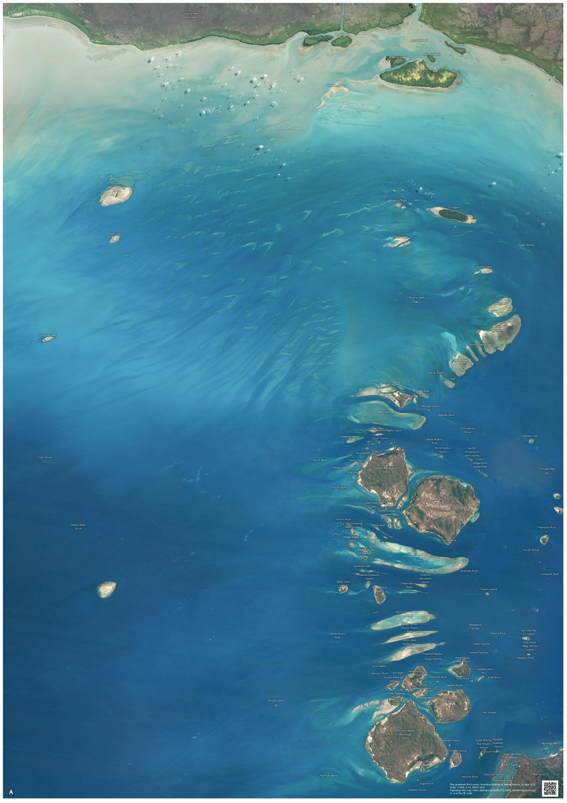
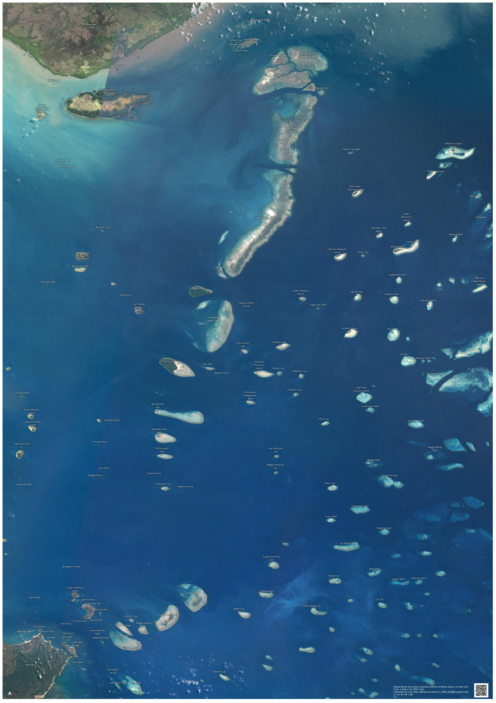
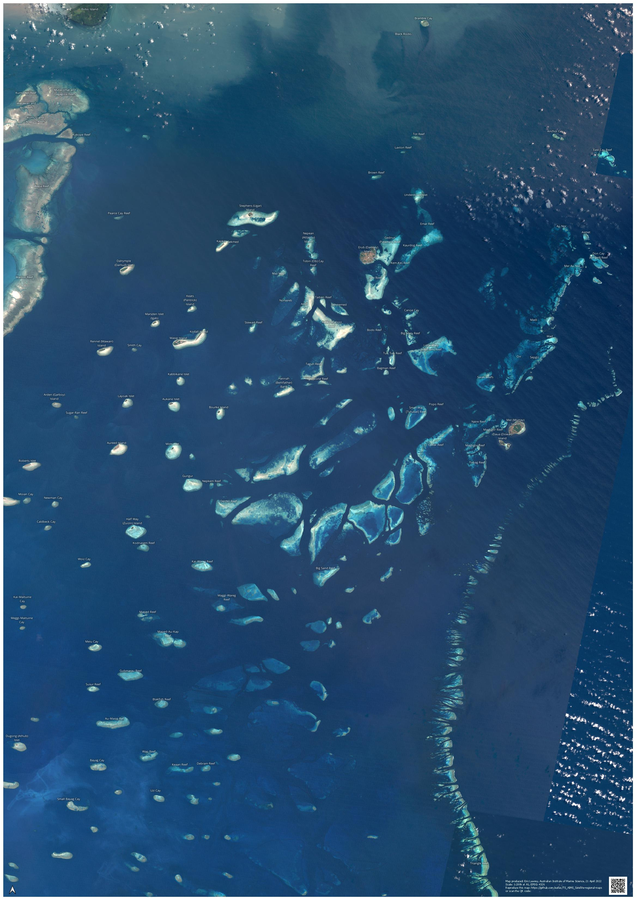

# Torres Strait Satellite Regional Maps
This repository contains files required to recreate the Torres Strait Satellite Regional Maps.

## What do these maps show?
These maps are large (A1) printable maps of the Torres Strait broken into four regions. 
These maps show satellite imagery of the region, overlaid with reef and island boundaries and
names. Not all features are named, just the more prominant features.

## Preview of the maps
There are 4 regional A1 maps and an A4 test map. All maps are at 1:200k scale. The A4 map
is for test printing on an A4 printer to check if the label fonts are readable.

## High resolution printable maps
[Download high resolution printable maps](https://nextcloud.eatlas.org.au/apps/sharealias/a/ts-aims-satellite-regional-maps)

## Map purpose
These maps were intended to be provided to Torres Strait rangers to mark off observations of 
Crown-of-Thorns Starfish maps using small stickers. These locations will then be digitised 
and converted to a dataset. The aim is to gather an overall picture of the spread of the current (2022) 
COTS out break in Torres Strait.

## What does this repository contain?
These repository contains QGIS files for recreating the printed maps from scratch. It also contains
a PowerShell script for download the source data for the maps.

This repository does not contain the source satellite imagery or the reef boundary dataset containing the
reef and island names. 

These datasets can be downloaded using the `01-get-source-data.ps1` Powershell script. 

## Datasets shown in maps
- [Torres Strait clear sky, clear water Landsat 5 satellite composite (NERP TE 13.1 eAtlas, AIMS, source: NASA)](https://eatlas.org.au/data/uuid/71c8380e-4cdc-4544-98b6-8a5c328930ad)
- [Complete Great Barrier Reef (GBR) Island and Reef Feature boundaries including Torres Strait Version 1b (NESP TWQ 3.13, AIMS, TSRA, GBRMPA)] 
(https://eatlas.org.au/data/uuid/d2396b2c-68d4-4f4b-aab0-52f7bc4a81f5)

## Reproducing these maps
Software requirements:
- Git (optional)
- QGIS

1. Clone this repository to your local machine using git clone, or download the repository from the
git webpage.
2. Run the `01-get-source-data.ps1` script to download the source data. To
run this in Windows, right-click on the script and click on `Run with PowerShell`. On Mac and
Linux you may need to install PowerShell, or alternatively open the script and download the
files using your web browser from the URLs in the script.
3. Load `02-Torres-Strait-regional-maps.qgz` in [QGIS](https://www.qgis.org/).
4. Use `Project\Layout Manager` in QGIS to view and export each map. Use `Export to PDF` and 
save to the `exports` folder. Use default settings.
5. Export preview images using `Export as image`. Set the export resolution to 100 dpi.

